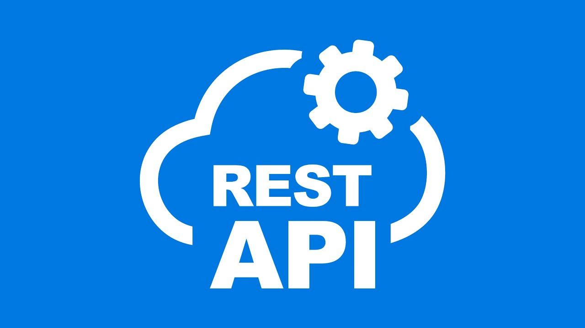

  

  

---

  <table cellpadding="10">
    <tr>
      <td align="center">
        
      </td>
      <td align="center">
        
      </td>
      <td align="center">
        
      </td>
      <td align="center">
        
      </td>
      <td align="center">
        
      </td>
    </tr>
  </table>

---

### About Me
- Final-year Computer Science student (HMR Institute) — focused on Software Development, Frontend & Applied AI.  
- Interned at **Deutsche Telekom Digital Labs (DTDL)** — built a unified AI chat platform (Angular + FastAPI).  
- I love building clean UX, scalable backends, and creative visual frontends.

---

# 🛠 Skills

<table style="width:100%; border-collapse:separate; border-spacing:8px;">

<tr>
<td align="center" style="width:10%; background: rgba(255,255,255,0.12); border: 1px solid rgba(255,255,255,0.25); border-radius:14px; padding:8px;"> Python</td>
<td align="center" style="width:10%; background: rgba(255,255,255,0.12); border: 1px solid rgba(255,255,255,0.25); border-radius:14px; padding:8px;"> &nbsp;&nbsp;&nbsp; C++</td>
<td align="center" style="width:10%; background: rgba(255,255,255,0.12); border: 1px solid rgba(255,255,255,0.25); border-radius:14px; padding:8px;"> JavaScript</td>
<td align="center" style="width:10%; background: rgba(255,255,255,0.12); border: 1px solid rgba(255,255,255,0.25); border-radius:14px; padding:8px;"> SQL</td>
<td align="center" style="width:10%; background: rgba(255,255,255,0.12); border: 1px solid rgba(255,255,255,0.25); border-radius:14px; padding:8px;"> MongoDB</td>
<td align="center" style="width:10%; background: rgba(255,255,255,0.12); border: 1px solid rgba(255,255,255,0.25); border-radius:14px; padding:8px;"> HTML5</td>
<td align="center" style="width:10%; background: rgba(255,255,255,0.12); border: 1px solid rgba(255,255,255,0.25); border-radius:14px; padding:8px;"> CSS3</td>
<td align="center" style="width:10%; background: rgba(255,255,255,0.12); border: 1px solid rgba(255,255,255,0.25); border-radius:14px; padding:8px;"> Tailwind</td>
<td align="center" style="width:10%; background: rgba(255,255,255,0.12); border: 1px solid rgba(255,255,255,0.25); border-radius:14px; padding:8px;"> Angular</td>
</tr>

<tr>
<td align="center" style="width:10%; background: rgba(255,255,255,0.12); border: 1px solid rgba(255,255,255,0.25); border-radius:14px; padding:8px;"> React</td>
<td align="center" style="width:10%; background: rgba(255,255,255,0.12); border: 1px solid rgba(255,255,255,0.25); border-radius:14px; padding:8px;"> Bootstrap</td>
<td align="center" style="width:10%; background: rgba(255,255,255,0.12); border: 1px solid rgba(255,255,255,0.25); border-radius:14px; padding:8px;"> FastAPI</td>
<td align="center" style="width:10%; background: rgba(255,255,255,0.12); border: 1px solid rgba(255,255,255,0.25); border-radius:14px; padding:8px;"> REST&nbsp;APIs</td>
<td align="center" style="width:10%; background: rgba(255,255,255,0.12); border: 1px solid rgba(255,255,255,0.25); border-radius:14px; padding:8px;"> Git</td>
<td align="center" style="width:10%; background: rgba(255,255,255,0.22); border: 1px solid rgba(255,255,255,0.35); border-radius:14px; padding:8px;"> GitHub</td>
<td align="center" style="width:10%; background: rgba(255,255,255,0.12); border: 1px solid rgba(255,255,255,0.25); border-radius:14px; padding:8px;"> VS&nbsp;Code</td>
<td align="center" style="width:10%; background: rgba(255,255,255,0.12); border: 1px solid rgba(255,255,255,0.25); border-radius:14px; padding:8px;"> Canva</td>
</tr>

</table>

---

### 💼 Experience
**Software Development Intern — Deutsche Telekom Digital Labs (DTDL)**  
*June 2025 – Aug 2025*  
Built a unified AI chat platform integrating 5+ AI models; optimized local context caching for 30% faster responses.

---

### 🎓 Education
**B.Tech in Computer Science & Engineering** — HMR Institute of Technology and Management (GGSIPU) — *2022–2026*  
CGPA: **8.91**

---

### 🚀 Highlighted Projects
- **Smart Energy Monitoring System** — FastAPI · React · MongoDB  
- **Photography Portfolio Website** — HTML · CSS · JavaScript  
- **Image Background Remover (API Tool)** — Frontend + API integration  

---

  
  
  

---

### 📈 3D Contribution Graph

---

  
<strong>🔎 Extras — What I'm focusing on now</strong>

- Improving full-stack performance for IoT dashboards  
- Learning advanced Three.js visualizations  
- Research writing on IoT-enabled solar panel cleaning systems  

  

